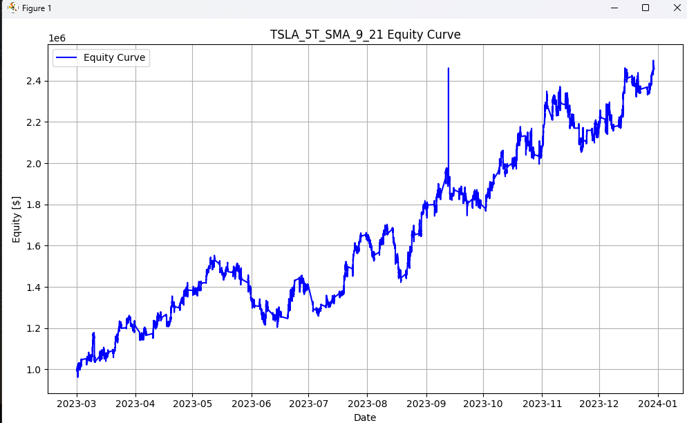

# Data Collector and Trading Strategy Tester Project

## Overview
This project involves collecting and processing intraday trading data for selected tickers using the Alpha Vantage API. The collected data is then used to test real trading strategies across different time frames and assets. The project demonstrates the capabilities of data collection, processing, and the evaluation of trading strategies in a simulated environment.

## Project Structure
main.py: Main script to run the data collection and strategy testing process.
strategy_classes.py: Contains classes and methods for different trading strategies.
passwords.py: (Ignored in .gitignore) Contains the API key for Alpha Vantage.

## Prerequisites
Python 3.8 or higher
Required Python packages:
requests
pandas
pickle

## Sensitive info
Remember to get a alpha_vantage API key here: https://www.alphavantage.co/support/#api-key
The free version has a low request limit. If you really want to explore many assets I would recoment the paid for one.

## Usage details
Edit the variables at the top of the main function in main.py to edit parameters of the strategy. To stop the data downloading every time the program is run I've implemented a force load option for if the data has already been downloaded. It should save a file called 'raw_data.csv'

If you want to add a large time-frame, add to the list of months in the main function. I hope to upgrade this system soon. Also to add to number of tickers that are being tested add to the ticker list in the main function. Beware of the API request limit if adding more to either.

Adjusting the 'winners' variable will show you the top N strategies performances. When the program is complete it will show you one graph at a time of the winners. The next version should hopefully have a dashboard to make viewing results easier.

The results should look like this:

## Add your own strategies
To add your own strategies you can add to the strategy_classes.py file. Look up how to use the backtest library. Here's a great intro video:
https://www.youtube.com/watch?v=e4ytbIm2Xg0

## Any questions?
Feel free to contact me anytime at https://www.linkedin.com/in/darius-trabalza/
